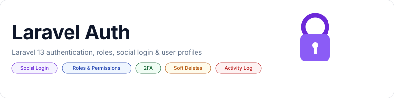

<p align="center">
    <picture>
        <source media="(prefers-color-scheme: dark)" srcset="art/banner-dark.svg">
        <source media="(prefers-color-scheme: light)" srcset="art/banner-light.svg">
        
    </picture>
</p>

<p align="center">Laravel Auth is a Complete Build of Laravel 12 with Email Registration Verification, Social Authentication, User Roles and Permissions, User Profiles, and Admin restricted user management system. Built on Bootstrap 4.</p>

<p align="center">
    <a href="https://github.com/jeremykenedy/laravel-auth/actions/workflows/laravel.yml"></a>
    <a href="https://styleci.io/repos/44714043"></a>
    <a href="https://dashboard.gitguardian.com"></a>
    <a href="https://sonarcloud.io/summary/new_code?id=jeremykenedy_laravel-auth"></a>
    <a href="https://www.codefactor.io/repository/github/jeremykenedy/laravel-auth"></a>
    <a href="https://app.codacy.com/gh/jeremykenedy/laravel-auth/dashboard"></a>
    <a href="https://scrutinizer-ci.com/g/jeremykenedy/laravel-auth/build-status/master"></a>
    <a href="https://scrutinizer-ci.com/g/jeremykenedy/laravel-auth/?branch=master"></a>
    <a href="https://scrutinizer-ci.com/code-intelligence"></a>
    <a href="#contributors"></a>
    <a href="https://madewithlaravel.com/p/laravel-auth/shield-link"></a>
    <a href="https://opensource.org/licenses/MIT"></a>
</p>

<p align="center">
    <a href="https://app.aikido.dev/repositories/3224660"></a>
</p>

<p align="center">
    <a href="https://github.com/sponsors/jeremykenedy"></a>
    <a href="https://github.com/jeremykenedy/laravel-auth/stargazers"></a>
    <a href="https://github.com/jeremykenedy"></a>
</p>

### Note

If you like this, you will love [Laravel Auth Spa](https://github.com/jeremykenedy/laravel-spa) with configurable providers from an admin panel.

#### Table of contents

- [About](#about)
- [Features](#features)
- [Installation Instructions](#installation-instructions)
    - [Full Installation Guide](INSTALLATION.md)
    - [Build the Front End Assets with Mix](#build-the-front-end-assets-with-mix)
  -   [Optionally Build Cache](#optionally-build-cache)
- [Seeds](docs/seeds.md)
- [Routes](docs/routes.md)
- [Socialite](docs/socialite.md)
- [Environment File](docs/environment.md)
- [Updates](docs/updates.md)
- [Screenshots](#screenshots)
- [File Tree](docs/file-tree.md)
- [Opening an Issue](#opening-an-issue)
- [License](#license)
-   [Contributors](#contributors)

### About

Laravel 12 with user authentication, registration with email confirmation, social media authentication, password recovery, and captcha protection. Uses official [Bootstrap 4](https://getbootstrap.com). This also makes full use of Controllers for the routes, templates for the views, and makes use of middleware for routing. Project can be stood up in minutes.

### Features

#### A [Laravel](https://laravel.com/) 12 with [Bootstrap](https://getbootstrap.com) 4.x project

- Built on [Laravel](https://laravel.com/) 12 and [Bootstrap](https://getbootstrap.com/) 4
- Uses [MySQL](https://github.com/mysql) Database (can be changed)
- Uses [Artisan](https://laravel.com/docs/master/artisan) to manage database migration, schema creations, and create/publish page controller templates
- Dependencies are managed with [COMPOSER](https://getcomposer.org/)
- Laravel Scaffolding **User** and **Administrator Authentication**
- User [Socialite Logins](https://github.com/laravel/socialite) ready to go - See API list used below
- [Google Maps API v3](https://developers.google.com/maps/documentation/javascript/) for User Location lookup and Geocoding
- CRUD (Create, Read, Update, Delete) Themes Management
- CRUD (Create, Read, Update, Delete) User Management
- Robust [Laravel Logging](https://laravel.com/docs/master/errors#logging) with admin UI using MonoLog
- Google [reCaptcha Protection with Google API](https://developers.google.com/recaptcha/)
-   User Registration with email verification
-   Makes use of Laravel [Mix](https://laravel.com/docs/master/mix) to compile assets
-   Makes use of [Language Localization Files](https://laravel.com/docs/master/localization)
-   Active Nav states using [Laravel Requests](https://laravel.com/docs/master/requests)
-   Restrict User Email Activation Attempts
-   Capture IP to users table upon signup
-   Uses [Laravel Debugger](https://github.com/barryvdh/laravel-debugbar) for development
-   Makes use of [Password Strength Meter](https://github.com/elboletaire/password-strength-meter)
-   Makes use of [hideShowPassword](https://github.com/cloudfour/hideShowPassword)
-   User Avatar Image AJAX Upload with [Dropzone.js](https://www.dropzonejs.com/#configuration)
-   User Gravatar using [Gravatar API](https://github.com/creativeorange/gravatar)
-   User Password Reset via Email Token
-   User Login with remember password
-   User [Roles/ACL Implementation](https://github.com/jeremykenedy/laravel-roles) with a Roles and Permissions GUI
-   Makes use of [Laravel's Soft Delete Structure](https://laravel.com/docs/master/eloquent#soft-deleting)
-   Soft Deleted Users Management System: restore, permanently delete, and view soft deleted users
-   Captures Soft Delete Date and Soft Delete IP
-   User Delete Account with Goodbye email
-   User Restore Deleted Account Token
-   Admin Routing Details UI
-   Admin PHP Information UI
-   Eloquent user profiles
-   User Themes
-   404 and 403 Pages
-   Configurable Email Notification via [Laravel-Exception-Notifier](https://github.com/jeremykenedy/laravel-exception-notifier)
-   Activity Logging using [Laravel-logger](https://github.com/jeremykenedy/laravel-logger)
-   Optional 2-step account login verfication with [Laravel 2-Step Verification](https://github.com/jeremykenedy/laravel2step)
-   Uses [Laravel PHP Info](https://github.com/jeremykenedy/laravel-phpinfo) package
-   Uses [Laravel Blocker](https://github.com/jeremykenedy/laravel-blocker) package

### Installation Instructions

1. Run `git clone https://github.com/jeremykenedy/laravel-auth.git laravel-auth`
2. Create a MySQL database for the project
    - `mysql -u root -p`, if using Vagrant: `mysql -u homestead -psecret`
    - `create database laravelAuth;`
    - `\q`
3. From the projects root run `cp .env.example .env`
4. Configure your `.env` file
5. Install composer, php-mysql, php-ext and php-dom (dependent on your distrubtion, For Debian run `apt install composer php-mysql php-ext php-dom`)
6. Run `composer update` from the projects root folder
7. From the projects root folder run:

```
php artisan vendor:publish --tag=laravelroles &&
php artisan vendor:publish --tag=laravel2step &&
php artisan vendor:publish --tag=laravel-email-database-log-migration
```

1. From the projects root folder run `sudo chmod -R 755 ../laravel-auth`
2. From the projects root folder run `php artisan key:generate`
3. From the projects root folder run `php artisan migrate`
4. From the projects root folder run `composer dump-autoload`
5. From the projects root folder run `php artisan db:seed`
6. Compile the front end assets with [npm steps](#using-npm) or [yarn steps](#using-yarn).

#### Build the Front End Assets with Vite

##### Using Yarn

1. Install yarn (dependent on your distribution)
2. From the projects root folder run `yarn install`
3. From the projects root folder run `yarn run dev` or `yarn run build`

##### Using NPM

1. From the projects root folder run `npm install`
2. From the projects root folder run `npm run dev` or `npm run build`

#### Optionally Build Cache

1. From the projects root folder run `php artisan config:cache`

### Seeds

Seeded roles, permissions, users, themes, and blocker lists: see [docs/seeds.md](docs/seeds.md).

### Routes

Full route list: see [docs/routes.md](docs/routes.md).

### Socialite

Socialite API key setup and adding more providers: see [docs/socialite.md](docs/socialite.md).

### Environment File

Full example `.env` file and Laravel documentation references: see [docs/environment.md](docs/environment.md).

### Updates

Changelog: see [docs/updates.md](docs/updates.md).

### Screenshots

<table>
    <tr>
        <td valign="top" width="50%"></td>
        <td valign="top" width="50%"></td>
    </tr>
    <tr>
        <td valign="top" width="50%"></td>
        <td valign="top" width="50%"></td>
    </tr>
    <tr>
        <td valign="top" width="50%"></td>
        <td valign="top" width="50%"></td>
    </tr>
    <tr>
        <td valign="top" width="50%"></td>
        <td valign="top" width="50%"></td>
    </tr>
    <tr>
        <td valign="top" width="50%"></td>
        <td valign="top" width="50%"></td>
    </tr>
</table>

<table>
    <tr>
        <td valign="top" width="50%"></td>
        <td valign="top" width="50%"></td>
    </tr>
    <tr>
        <td valign="top" width="50%"></td>
        <td valign="top" width="50%"></td>
    </tr>
    <tr>
        <td valign="top" width="50%"></td>
        <td valign="top" width="50%"></td>
    </tr>
    <tr>
        <td valign="top" width="100%" colspan="2"></td>
    </tr>
</table>

<table>
    <tr>
        <td valign="top" width="50%"></td>
        <td valign="top" width="50%"></td>
    </tr>
    <tr>
        <td valign="top" width="50%"></td>
        <td valign="top" width="50%"></td>
    </tr>
    <tr>
        <td valign="top" width="50%"></td>
        <td valign="top" width="50%"></td>
    </tr>
    <tr>
        <td valign="top" width="50%"></td>
        <td valign="top" width="50%"></td>
    </tr>
    <tr>
        <td valign="top" width="50%"></td>
        <td valign="top" width="50%"></td>
    </tr>
</table>

<table>
    <tr>
        <td valign="top" width="50%"></td>
        <td valign="top" width="50%"></td>
    </tr>
    <tr>
        <td valign="top" width="50%"></td>
        <td valign="top" width="50%"></td>
    </tr>
    <tr>
        <td valign="top" width="100%" colspan="2"></td>
    </tr>
</table>

<table>
    <tr>
        <td valign="top" width="50%"></td>
        <td valign="top" width="50%"></td>
    </tr>
    <tr>
        <td valign="top" width="50%"></td>
        <td valign="top" width="50%"></td>
    </tr>
    <tr>
        <td valign="top" width="50%"></td>
        <td valign="top" width="50%"></td>
    </tr>
    <tr>
        <td valign="top" width="50%"></td>
        <td valign="top" width="50%"></td>
    </tr>
    <tr>
        <td valign="top" width="50%"></td>
        <td valign="top" width="50%"></td>
    </tr>
    <tr>
        <td valign="top" width="100%" colspan="2"></td>
    </tr>
</table>

<table>
    <tr>
        <td valign="top" width="50%"></td>
        <td valign="top" width="50%"></td>
    </tr>
    <tr>
        <td valign="top" width="50%"></td>
        <td valign="top" width="50%"></td>
    </tr>
    <tr>
        <td valign="top" width="50%"></td>
        <td valign="top" width="50%"></td>
    </tr>
    <tr>
        <td valign="top" width="50%"></td>
        <td valign="top" width="50%"></td>
    </tr>
    <tr>
        <td valign="top" width="50%"></td>
        <td valign="top" width="50%"></td>
    </tr>
    <tr>
        <td valign="top" width="50%"></td>
        <td valign="top" width="50%"></td>
    </tr>
    <tr>
        <td valign="top" width="50%"></td>
        <td valign="top" width="50%"></td>
    </tr>
    <tr>
        <td valign="top" width="100%" colspan="2"></td>
    </tr>
</table>


### File Tree

See [docs/file-tree.md](docs/file-tree.md).

### Opening an Issue

Before opening an issue there are a couple of considerations:

-   You are all awesome!
-   **Please Read the instructions** and make sure all steps were _followed correctly_.
-   **Please Check** that the issue is not _specific to the development environment_ setup.
-   **Please Provide** _duplication steps_.
-   **Please Attempt to look into the issue**, and if you _have a solution, make a pull request_.
-   **Please Show that you have made an attempt** to _look into the issue_.
-   **Please Check** to see if the issue you are _reporting is a duplicate_ of a previous reported issue.

### License

This package is open-sourced software licensed under the [MIT license](LICENSE).

### Contributors

-   Thanks goes to these [wonderful people](https://github.com/jeremykenedy/laravel-auth/graphs/contributors):
-   Please feel free to contribute and make pull requests!
